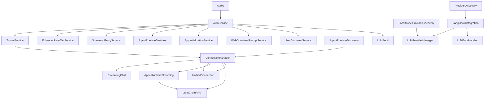

# Service Lifecycle & Dependency Graph

Pistisai uses a centralized service locator (`lib/di/locator.dart`) to ensure that long-lived services are constructed once during bootstrap and disposed in a predictable order.

## Boot Sequence

1. `AppBootstrapper.load()` (see `lib/bootstrap/bootstrapper.dart`)
   - Configures SQLite FFI when running on desktop.
   - Invokes `setupServiceLocator()` so every service registers itself with GetIt.
   - Returns `AppBootstrapData` so the root widget tree can decide whether to render native shell affordances.
2. `main.dart`
   - Wraps the app with a `FutureProvider<AppBootstrapData?>` and waits for bootstrap to finish.
   - Provides all registered services via `ChangeNotifierProvider.value` so they are not re-created by the widget tree.
3. `HomeScreen`
   - Uses `LayoutBuilder` / `HomeLayout` for responsive UI.
   - Requests services from the provider tree (which ultimately resolves through the service locator).

## Service Dependencies

Legend:

- **Auth0Service** instances differ for web/desktop at registration time.
- **AuthService** publishes authentication state and is the primary trigger for services that depend on user session context.
- **ConnectionManagerService** should orchestrate the selected agent runtime path. Hermes is the current first test path; OpenClaw and compatible agent gateways are primary agent runtime paths discovered or configured by setup.
- **Local model providers** such as Ollama and LM Studio belong to memory/background feature support, not the main agent channel.
- **Tailscale-first secure mesh** is the preferred multi-device transport. Custom tunnel services are legacy/fallback unless a task explicitly targets them.

## Lifecycle Contract

- Every service that registers with `setupServiceLocator()` **must**:
  - Accept dependencies via constructor injection only.
  - Provide an `initialize()` (or equivalent) method that completes before the service is exposed to the widget tree.
  - Remove listeners and close streams inside `dispose()` if they allocate platform resources.

- The service locator pushes a single scope (`core`) during bootstrap. Future scopes (e.g., per-user) can be layered on top without refactoring consumers.

## Logging

All services use `appLogger` (`lib/utils/logger.dart`) instead of `debugPrint` so log output can be redirected or persisted. The logger defaults to a concise, non-colored printer that works well inside GitHub Actions logs.
