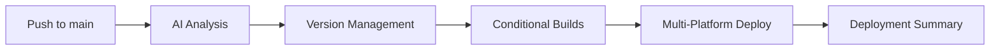

# Unified Deployment Workflow

## Overview

The Unified Deployment Workflow (`build-pipeline.yml`) represents a significant evolution in Pistisai's CI/CD system. It consolidates AI analysis, version management, and multi-platform deployment into a single intelligent workflow, eliminating the complexity of previous orchestrator-based systems.

## Architecture

### Single Workflow Design



### Key Components

1. **AI Analysis Job** (`ai_change_analysis`)
   - Analyzes commits and file changes using git-based forensic analysis
   - Determines platform deployment needs (api, web, streaming, postgres, etc.)
   - Checks GHCR for existing image tags to skip redundant builds
   - Calculates semantic version bumps
   - Makes deployment decisions with reasoning

2. **Conditional Build Jobs**
   - `build_base`: Core Docker images (base/build)
   - `build_api`: Node.js API backend
   - `build_web`: Flutter web frontend
   - `build_postgres`: Custom database service
   - `build_streaming`: WebSocket proxy service

3. **Deployment Jobs**
    - `deploy`: Azure VM deployment with health verification
    - `purge_cloudflare`: Cache clearing for latest web deployment

4. **Summary Job** (`pipeline_metrics`)
   - Comprehensive status reporting
   - Links to deployed services
   - Execution metrics for each stage

## Workflow Triggers

### Automatic Triggers

```yaml
on:
  push:
    branches:
      - main
```

### Manual Triggers

```yaml
workflow_dispatch:
```

## AI Analysis Integration

### Forensic Analysis Process

1. **File Change Detection**: Analyzes changed files over the current push or HEAD^
2. **Component Mapping**: Maps changed paths to specific microservices
3. **Registry Check**: Queries GHCR API to see if the current GITHUB_SHA already has a built image
4. **Version Calculation**: Calculates appropriate patch version bump
5. **Deployment Decision**: Sets output flags for downstream build jobs

## Version Management

### Semantic Versioning

- **Patch** (`X.Y.Z`): Automated increment for every component change

### Version File Updates

The workflow automatically updates:

- `assets/version.json` (primary source)

### Git Operations

```bash
# Commit version changes
git commit -m "chore: automated version bump to $NEW_VERSION [skip ci]"
git push origin main
```

## Multi-Platform Builds

### Cloud Services (Azure)

**Conditional Building**: Only builds when GHCR check fails or files changed.

**Services Built**:

- **Web Service**: Flutter web app with Nginx
- **API Backend**: Express.js API server
- **Streaming Proxy**: WebSocket proxy service
- **Postgres**: Customized database container

**Docker Registry**: GitHub Container Registry (GHCR) - `ghcr.io/pistisai/Pistisai`

## Deployment Process

### Cloud Deployment

**Target**: Azure Virtual Machine (Docker Swarm)

**Process**:

1. Azure authentication via Service Principal
2. VM power state verification (starts VM if stopped)
3. Secure environment variable injection via Base64 encoding
4. Execute deployment script via `az vm run-command invoke`
5. Pull latest images from GHCR and update Docker Stack
6. Purge Cloudflare cache

## Deployment Summary

### Comprehensive Reporting

The workflow generates a detailed execution summary in the `pipeline_metrics` job, reporting success/failure for:

- Analysis
- Deployment
- Tunnel Connectivity
- Cloudflare Status
- Release Status

## monitoring and Debugging

### Workflow Monitoring

```bash
# List recent deployments
gh run list --workflow="build-pipeline.yml" --limit 5
 
# View deployment details
gh run view <run-id>
```

### Debugging Failures

1. **Analysis Failures**: Check git diff logs in the Analysis job.
2. **Build Failures**: Verify Docker context in `services/` and `config/docker/`.
3. **Deployment Failures**: Check Azure connectivity and `scripts/vm-deploy.sh` output.

## Conclusion

The Unified Deployment Workflow provides:

- **Simplified Architecture**: Single workflow for all cloud services
- **Intelligent Skipping**: SHA-based GHCR tag checking saves time and compute
- **Azure Centric**: Native integration with Azure CLI via Service Principal
- **Better Visibility**: Complete status reporting in one view

This system ensures that Pistisai is deployed reliably and efficiently with every change to the main branch.
